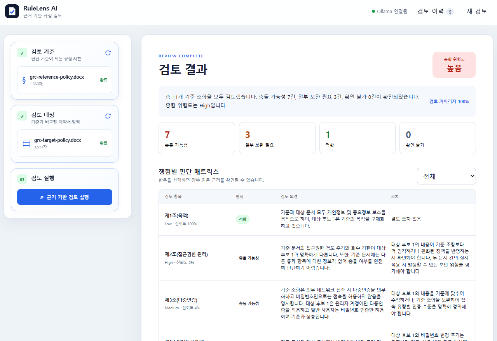

# RuleLens AI

RuleLens AI는 기준 문서와 검토 대상 문서를 비교하여 규정 충돌 가능성, 보완할 내용, 확인 불가 항목을 근거와 함께 정리하는 로컬 문서 검토 도구입니다. 문서와 결과는 PC에 저장되며 외부 클라우드 LLM으로 전송되지 않습니다.

AI 결과는 초안입니다. 법률·규제·감사에 사용할 때는 반드시 원문을 대조하고 담당자의 최종 판단을 거쳐 주세요.

## 처음 시작하기

필수 환경: Windows 10/11, Node.js 22.13 이상, npm 11 이상, Ollama 0.32 이상, gemma4:e2b 모델.

프로젝트 폴더에서 다음을 실행합니다.

    npm ci
    Copy-Item .env.example .env
    ollama pull gemma4:e2b
    npm run dev

Ollama가 실행 중이 아니라면 별도 PowerShell에서 ollama serve를 실행하세요. ollama list로 모델을 확인할 수 있습니다.

브라우저에서 http://127.0.0.1:5173 을 엽니다. 개발 API 기본 주소는 http://127.0.0.1:3000이며 /api/health에서 SQLite와 Ollama 연결 상태를 확인할 수 있습니다. 개발 모드에서 PORT를 바꿀 때는 VITE_API_PORT도 같은 값으로 맞추세요.

## 1. 시스템에서 할 수 있는 일

1. 왼쪽 검토 기준에 법령·내부 규정·계약서 등 기준 문서를 올립니다.
2. 검토 대상에 실제 검토할 정책·보고서·계획서를 올립니다.
3. 두 문서가 표시되면 근거 기반 검토 실행을 누릅니다.

지원 형식은 PDF, DOCX, HWPX, XLSX, TXT, MD, CSV입니다. 파일 한 개는 기본 30MB, 추출 텍스트는 기본 2,000,000자까지 처리합니다. 스캔 PDF OCR, 레거시 HWP, 암호화 문서는 지원하지 않습니다.

검토 제목은 대상 파일 이름으로 자동 생성됩니다. 검토 이력의 연필 아이콘으로 제목을 바꿀 수 있고, 휴지통 아이콘으로 검토와 연결된 결과를 영구 삭제할 수 있습니다. 최근 비정상 종료 작업은 다음 서버 시작 때 자동으로 대기열에 복구됩니다.

결과에는 커버리지, 전체 위험도(Low/Medium/High/Critical), 조항별 판정(적합/일부 보완 필요/충돌 가능성/확인 불가), 양쪽 문서의 인용 근거, 조치 로드맵이 표시됩니다. 결과는 복사하거나 PDF로 내려받을 수 있습니다.

## 판정 읽는 법

| 표시 | 의미 | 권장 조치 |
| --- | --- | --- |
| 적합 | 기준과 대상이 일치하는 것으로 보임 | 표본 확인 후 종결 |
| 일부 보완 필요 | 조건·표현·절차 일부 누락 | 누락 항목 보완 |
| 충돌 가능성 | 기준과 대상이 다르거나 반대일 수 있음 | 원문 대조 후 우선 수정 |
| 확인 불가 | 근거 부족으로 판단할 수 없음 | 자료 보강 후 재검토 |
| Critical / High | 영향도가 큰 쟁점 | 담당자 검토 우선 |

## 느리거나 실패할 때

- Ollama 연결 오류: Ollama 앱 또는 ollama serve를 실행하고 OLLAMA_URL(기본 http://127.0.0.1:11434)을 확인합니다. 모델이 없으면 ollama pull gemma4:e2b를 실행합니다.
- 검토 지연: 첫 요청은 모델 로딩으로 오래 걸릴 수 있고 CPU 환경에서는 더 느립니다. 진행률이 바뀌면 정상입니다. 문맥·출력 길이는 제한되어 있으며 처리 불가 조항은 확인 불가로 기록됩니다. 검토 중에는 자동 재시작 명령 npm run dev:watch를 사용하지 마세요.
- 서버 재시작 뒤 실패: 최근 중단 작업은 자동 재개되고 오래된 작업은 실패로 표시될 수 있습니다.
- 파싱·용량 오류: 실제 파일 형식, 암호화 여부를 확인하고 필요하면 MAX_UPLOAD_BYTES와 MAX_EXTRACTED_CHARS를 조정합니다.

## 설정

| 변수 | 기본값 | 설명 |
| --- | --- | --- |
| PORT | 3000 | API·운영 서버 포트 |
| VITE_API_PORT | 3000 | 개발 화면이 연결할 API 포트 |
| OLLAMA_URL | http://127.0.0.1:11434 | Ollama 주소 |
| OLLAMA_MODEL | gemma4:e2b | 사용할 모델 |
| OLLAMA_TIMEOUT_MS | 180000 | 모델 요청 제한 시간(ms) |
| OLLAMA_CONTEXT_LENGTH | 4096 | 입력 문맥 상한 |
| OLLAMA_MAX_OUTPUT_TOKENS | 640 | 출력 상한 |
| MAX_UPLOAD_BYTES | 31457280 | 파일 한 개 최대 크기 |
| MAX_EXTRACTED_CHARS | 2000000 | 추출 텍스트 최대 길이 |
| MAX_CONCURRENT_REVIEWS | 1 | 동시 검토 수 |
| DATABASE_PATH | ./data/rulelens.db | SQLite 경로 |
| DATA_DIR | ./data | 업로드 파일 경로 |
| PDF_FONT_PATH | 자동 탐색 | PDF 한글 글꼴 경로 |

운영 실행은 npm run build 후 npm start입니다. Docker는 docker compose up --build로 실행하며 http://127.0.0.1:3100에서 열립니다. Ollama는 호스트에서 실행하고 docker compose down 후에도 ./data의 이력은 남습니다.

## 개발자용 검증

npm run typecheck, npm run lint, npm test, npm run test:e2e, npm run build를 사용합니다. 소스 수정 중에만 npm run dev:watch를 사용하고 일반 실행은 npm run dev를 사용하세요.

## API 요약

| 메서드 | 경로 | 용도 |
| --- | --- | --- |
| GET | /api/health | 서버·SQLite·Ollama 상태 |
| GET | /api/models | 설치된 모델 |
| POST | /api/documents | 문서 업로드·파싱 |
| GET | /api/documents/:id | 문서 메타데이터 |
| POST | /api/reviews | 새 검토 |
| GET | /api/reviews | 검토 이력 |
| GET | /api/reviews/:id | 결과·finding |
| PATCH | /api/reviews/:id | 검토 제목 변경 |
| GET | /api/reviews/:id/events | 진행률 SSE |
| POST | /api/reviews/:id/cancel | 검토 취소 |
| GET | /api/reviews/:id/report.pdf | PDF 보고서 |
| DELETE | /api/reviews/:id | 검토와 연결 데이터 삭제 |

## 개인정보와 프로젝트 구조

문서·SQLite·로그는 로컬 data/에 저장됩니다. 로그인과 권한 관리는 없으므로 신뢰할 수 있는 내부 PC에서만 실행하세요. 검토 삭제는 영구 삭제입니다.

src/는 Svelte 화면, server/는 API·파서·검토 파이프라인, shared/는 공유 스키마, tests/는 테스트, public/는 정적 파일과 시스템 로고입니다.

저장소: https://gitlab.aigov.go.kr/Ubermensch/ruleCheck_AI
